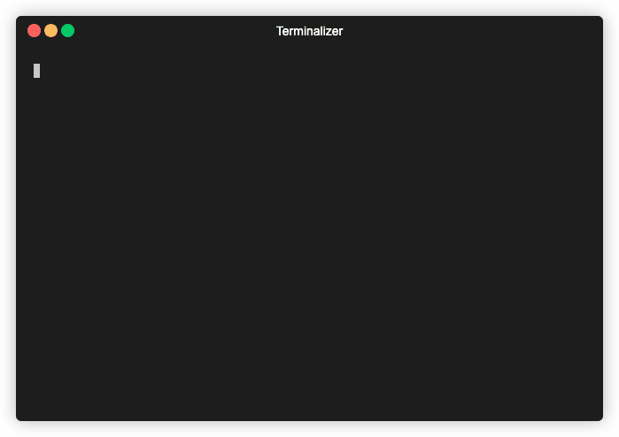
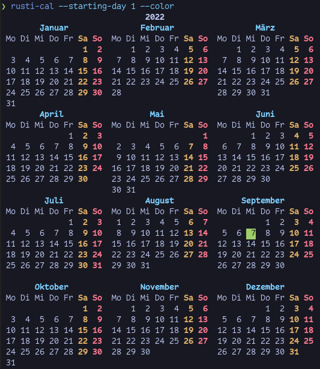

<p align="center">
  
</p>

⚡️ Lightning-fast and minimal calendar command line. It's similar to `cal`.
Written in Rust 🦀


## How Can Install?

```sh
$ cargo install rusti-cal
```

If you are on NetBSD, there's a package available from the official repositories.
To install simply run:

```sh
# pkgin install rusti-cal
```

## Usage

```sh
$ rusti-cal <year>
```

## Hands On



## Optional Usage

+ Start Week With Sunday (Default)

```sh
$ rusti-cal <year> --starting-day 0
```

+ Start Week With Mondays

```sh
$ rusti-cal <year> --starting-day 1
```

+ Start Week With Tuesday

```sh
$ rusti-cal <year> --starting-day 2
```

+ Start Week With Wednesday

```sh
$ rusti-cal <year> --starting-day 3
```

+ Start Week With Thursday

```sh
$ rusti-cal <year> --starting-day 4
```

+ Start Week With Friday

```sh
$ rusti-cal <year> --starting-day 5
```

+ Start Week With Saturday

```sh
$ rusti-cal <year> --starting-day 6
```

## Locale based names

The current locale can be overwritten with the `LANG` environment variable to display the calendar in another language.

```sh
$ LANG=fr_FR rusti-cal <year>
```

## Colored output

Enable colored output with the `--color` or `-c` option. This highlights weekend days and the current day.

```sh
$ rusti-cal <year> --color
```

